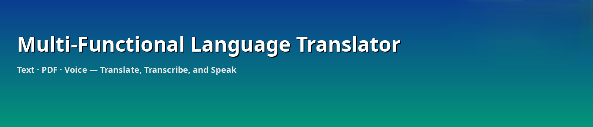
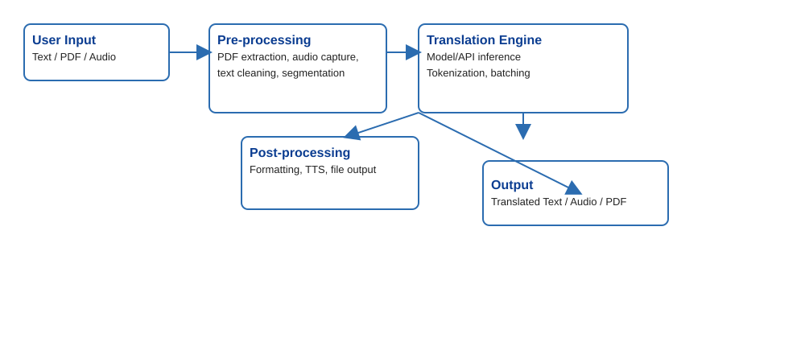
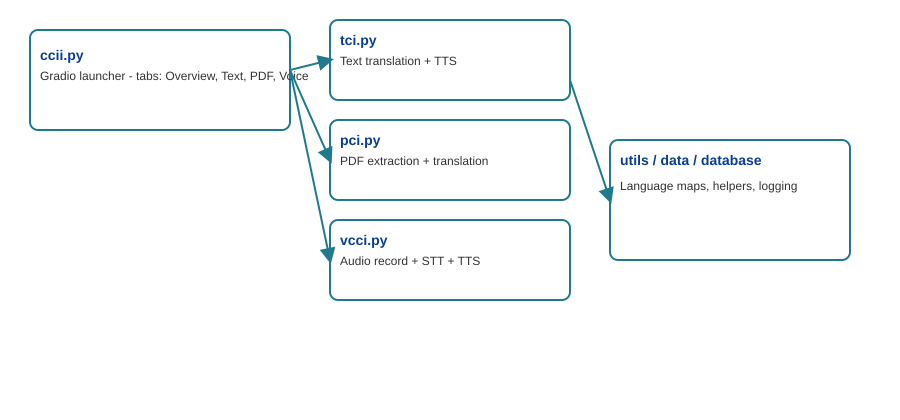
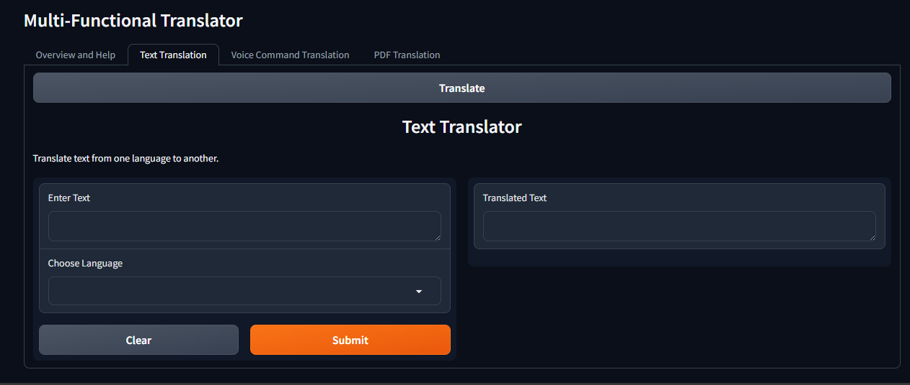
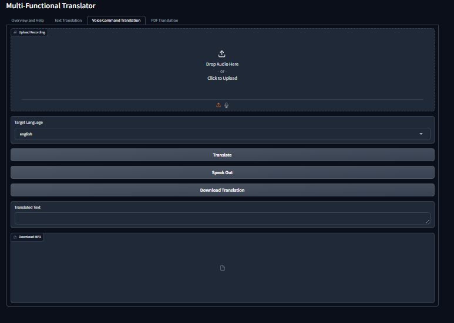
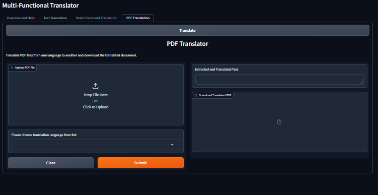

# 🌐 Multi‑Functional Language Translator



[](https://github.com/abhijeeth-pa/Language-translator/actions)
[](https://github.com/abhijeeth-pa/Language-translator/releases)
[](LICENSE_OFL.txt)

A Python-based multilingual translation application with support for **text**, **PDF**, and **voice** translation. Built with **Gradio** and modular Python components for extraction, translation, and speech processing.

---

## 🔖 Quick Links

- Live UI: run locally with `python ccii.py`
- Article / Documentation: `article/Technical-Article.md`
- Demo assets: `assets/samples/`
- Results & outputs: `assets/outputs/`

---

## 📁 Project Structure

```
Language-translator/
├── ccii.py
├── tci.py
├── pci.py
├── vcci.py
├── data.py
├── data2.py
├── data3.py
├── database.py
├── assets/
│   ├── banner.png
│   ├── flow.svg
│   └── modules.svg
├── article/
├── requirements.txt
└── README.md
```

---

## 🧭 Architecture & Flow

### System Flow


**High-level steps**
1. User provides input (Text / PDF / Audio)  
2. Pre-processing: extract text, record audio, normalize content  
3. Translation engine: model or API performs inference  
4. Post-processing: format, TTS, package outputs  
5. Deliverables: translated text, spoken audio, downloadable document

### Module Diagram


---

## 🔍 Module Summary

- **ccii.py** — Gradio launcher; stitches Text, PDF and Voice interfaces into tabs.  
- **tci.py** — Text translation handler: mapping, translate, optional TTS.  
- **pci.py** — PDF handler: extract → clean → translate → output.  
- **vcci.py** — Voice handler: record → STT → translate → TTS playback.  
- **data.py / data2.py / data3.py** — Language maps, tokenizer settings, helper constants.  
- **database.py** — Optional logging/persistence utilities.

---

## 🛠️ Installation

```bash
git clone https://github.com/abhijeeth-pa/Language-translator.git
cd Language-translator
python -m venv venv
source venv/bin/activate   # or venv\Scripts\activate on Windows
pip install -r requirements.txt
```

---

## ▶️ Running the App

Start the full Gradio interface:

```bash
python ccii.py
```

Open your browser to `http://localhost:7860`.

---

## 🧪 Reproducibility & Experiments

Recommended files for reproducibility:

- `scripts/run_experiments.py` — runs translation benchmarks (create if absent).  
- `assets/samples/` — sample PDFs and audio for quick reproduction.  
- Save outputs to `assets/outputs/` and include a README in that folder explaining experiment parameters.

---

## 🧾 License & Credits

- Fonts included under OFL (see `LICENSE_OFL.txt`).  
- Project code: MIT License (add LICENSE file if you choose MIT).

---

## 📸 Screenshots / Previews
The application is live at : https://huggingface.co/spaces/abhi2400/Language_Translator

Screenshots of application:

  
  


---


